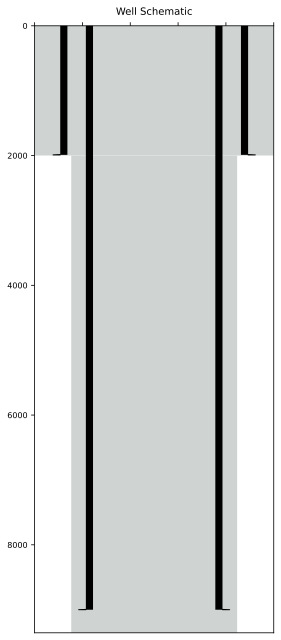
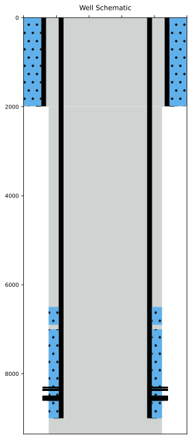
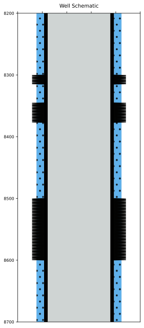
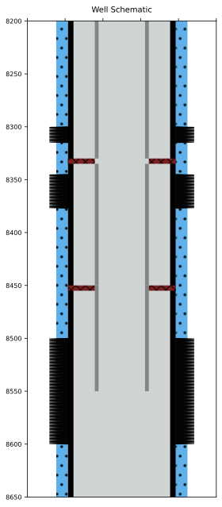

# Create a Simple Well Schematics.

```python
import matplotlib.pyplot as plt 
from wellschematicspy import  WellSchema, OpenHole,Casing,Cement,Perforation,Tubing,BridgePlug,Sleeve,Plug,Packer
```

You can create a well Schematics with the basics parametes with above a series of Python objects that were imported. 

As they are created on top of Pydantic you can easily export the data to either json or a dictionary


## Open Hole 

The first thing a well must have is a well defined Open Hole. 
To define a OpenHole it is required the **Top**, **Bottom** and **Diameter**


```python
oh1 = OpenHole(
    name = 'surface_hole',
    top = 0,
    bottom=2000,
    diameter = 12.25
)

oh2 = OpenHole(
    name = 'production_hole',
    top = 2000,
    bottom=9356,
    diameter = 8.5
)
```

### Plot The Schematics

To plot a well Schematics you have to create an WellSchema Object and assign its attributes. 

One of the attributes you can attach to a WellSchema is a list of OpenHole Object


```python
wsh = WellSchema(
    open_holes = [oh2,oh1]
)

wsh.plot(xtick=True)
```


    

    


## Add Casings

You can add casing to the WellSchema by creating the Casing object


```python
csg1 = Casing(
    name='surface_casing',
    top=0,
    bottom=1990,
    diameter = 9.625
)

csg2 = Casing(
    name='surface_casing',
    top=0,
    bottom=9000,
    diameter = 7
)
```

### Plot WellSchema with Casings

To plot the Well Schema with the casings created above, just assing a list of Casings to WellSchema attribute *casings*


```python
wsh.casings = [csg1,csg2]

wsh.plot()
```


    

    


## Add Cement

A Cement object must be attached to a Casing Object. You can define more than one cement to each casing


```python
cmt1 = Cement(
    name='surface_cement',
    top=0,
    bottom=1985,
    oh=12.25
)

cmt2_sec1 = Cement(
    name='prod_cement',
    top=7000,
    bottom=9000,
    oh=8.5
)

cmt2_sec2 = Cement(
    name='squeeze',
    top=6500,
    bottom=6900,
    oh=8.5
)
```

If the WellSchema is already created just assign to each casing a list of cement object. 


```python
## 
wsh.casings[0].cement = [cmt1]
wsh.casings[1].cement = [cmt2_sec1,cmt2_sec2]

wsh.plot()
```


    

    


## Perforations

Like the Cement, Perforations are also attached to casings.


```python
perf1 = Perforation(
    name='upper_perf',
    top=8300,
    bottom=8315,
    oh=8.5
)

perf2 = Perforation(
    name='mid_perf',
    top=8345,
    bottom=8377,
    oh=8.5
)

perf3 = Perforation(
    name='lower_perf',
    top=8500,
    bottom=8600,
    oh=8.5
)
```


```python
wsh.casings[1].perforations = [perf1,perf2,perf3]

wsh.plot()
```


    

    


You can set the depth limits when plotting the schema


```python
wsh.plot(lims=[8200,8700])
```


    

    


## Create Completion

You can create a simple completion schema by adding them to *completion* attribute in the well


```python
tb1 = Tubing(
    name = 'Production String',
    top = 0,
    bottom = 8330,
    diameter = 3.5
)

pkr1 = Packer(
    name = 'Production String',
    top = 8330,
    bottom = 8335,
    diameter = 7,
    inner_diameter = 3.5
)

tb2 = Tubing(
    name = 'Production String',
    top = 8335,
    bottom = 8450,
    diameter = 3.5
)

pkr2 = Packer(
    name = 'Production String',
    top = 8450,
    bottom = 8455,
    diameter = 7,
    inner_diameter = 3.5
)

tb3 = Tubing(
    name = 'Production String',
    top = 8450,
    bottom = 8550,
    diameter = 3.5
)
```


```python
wsh.completion=[tb1,tb2,tb3,pkr2,pkr1]

wsh.plot(lims=[8200,8650])
```


    

    


## Export & Import 

You can export the WellSchema to either dictionary or json due they are based pn Pydantic models. 

In the same way you can create a instance of any of the objects described so far from a dictionary


```python
dict_well = wsh.dict()

well_from_dict = WellSchema(**dict_well)

print(type(well_from_dict))
```

    <class 'wellschematicspy.schematics.WellSchema'>

